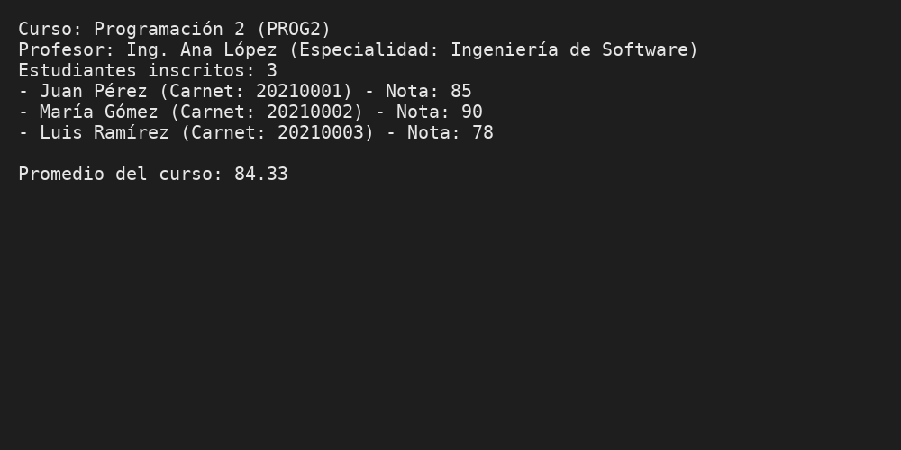

# SistemaGestionAcademica


 
Sistema de Gestión Académica (POO en C#). Incluye herencia (`Persona` → `Estudiante`/`Profesor`), y agregación en `Curso` (profesor + lista de estudiantes).  
Consola interactiva con menú para crear y listar entidades, asignarlas a cursos, registrar notas y calcular promedios.

## Requisitos de ejecución
- .NET 8 SDK o Visual Studio 2022/2022+ con soporte para .NET 8.

## Cómo abrir
- **Opción A (Visual Studio)**: abre el archivo `SistemaGestionAcademica.sln` y ejecuta.
- **Opción B (CLI)**:
  ```bash
  dotnet run --project SistemaGestionAcademica/SistemaGestionAcademica.csproj
  ```

## Funcionalidades principales
- Crear profesores, estudiantes y cursos.
- Asignar profesor a curso.
- Agregar estudiantes a curso.
- Registrar notas por curso y estudiante.
- Mostrar resumen de curso y promedio.
- Datos de ejemplo precargados: 2 profesores, 3 cursos, 4 estudiantes.

## Estructura
```
SistemaGestionAcademica/
 ├─ SistemaGestionAcademica.sln
 └─ SistemaGestionAcademica/
    ├─ SistemaGestionAcademica.csproj
    ├─ Program.cs
    ├─ Models/
    │  ├─ Persona.cs
    │  ├─ Estudiante.cs
    │  ├─ Profesor.cs
    │  └─ Curso.cs
    ├─ Services/
    │  └─ SistemaAcademico.cs
    ├─ screenshots/
    │  └─ resultado_programacion2.png
    └─ README.md
```

## Git y GitHub (sugerido)
```bash
cd SistemaGestionAcademica
git init
git add .
git commit -m "chore: inicializa solución y estructura del proyecto"

git branch -M main
# Crea un repo vacío en GitHub y reemplaza la URL de ejemplo:
git remote add origin https://github.com/USUARIO/SistemaGestionAcademica.git
git push -u origin main

# Commits sugeridos conforme avances
git commit -am "feat: clases Persona/Estudiante/Profesor/Curso"
git commit -am "feat(menu): menú interactivo y datos precargados"
git commit -am "feat: registrar nota y promedio por curso"
git commit -am "docs: agrega screenshots y README"
git push
```

## Evidencias

